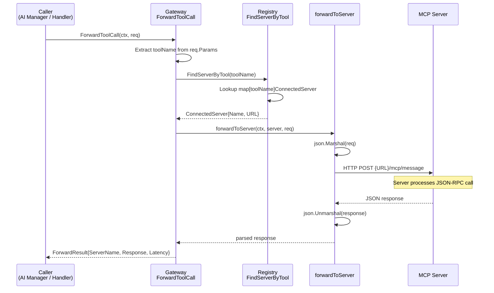

# mcp

```mermaid
sequenceDiagram
    participant C as Caller<br/>(AI Manager / Handler)
    participant G as Gateway<br/>ForwardToolCall
    participant R as Registry<br/>FindServerByTool
    participant F as forwardToServer
    participant S as MCP Server

    C->>G: ForwardToolCall(ctx, req)
    G->>G: Extract toolName from req.Params
    G->>R: FindServerByTool(toolName)
    R->>R: Lookup map[toolName]ConnectedServer
    R-->>G: ConnectedServer{Name, URL}

    G->>F: forwardToServer(ctx, server, req)
    F->>F: json.Marshal(req)
    F->>S: HTTP POST {URL}/mcp/message
    Note over S: Server processes JSON-RPC call

    S-->>F: JSON response
    F->>F: json.Unmarshal(response)
    F-->>G: parsed response

    G-->>C: ForwardResult{ServerName, Response, Latency}

```
