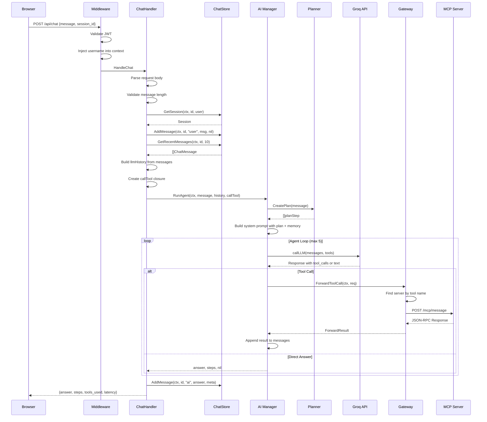

# request_flow

```mermaid
sequenceDiagram
    participant B as Browser
    participant MW as Middleware
    participant H as ChatHandler
    participant CS as ChatStore
    participant M as AI Manager
    participant PL as Planner
    participant LLM as Groq API
    participant GW as Gateway
    participant SRV as MCP Server

    B->>MW: POST /api/chat {message, session_id}
    MW->>MW: Validate JWT
    MW->>MW: Inject username into context
    MW->>H: HandleChat

    H->>H: Parse request body
    H->>H: Validate message length

    H->>CS: GetSession(ctx, id, user)
    CS-->>H: Session

    H->>CS: AddMessage(ctx, id, "user", msg, nil)
    H->>CS: GetRecentMessages(ctx, id, 10)
    CS-->>H: []ChatMessage

    H->>H: Build llmHistory from messages
    H->>H: Create callTool closure

    H->>M: RunAgent(ctx, message, history, callTool)

    M->>PL: CreatePlan(message)
    PL-->>M: []planStep

    M->>M: Build system prompt with plan + memory

    loop Agent Loop (max 5)
        M->>LLM: callLLM(messages, tools)
        LLM-->>M: Response with tool_calls or text

        alt Tool Call
            M->>GW: ForwardToolCall(ctx, req)
            GW->>GW: Find server by tool name
            GW->>SRV: POST /mcp/message
            SRV-->>GW: JSON-RPC Response
            GW-->>M: ForwardResult
            M->>M: Append result to messages
        else Direct Answer
            M-->>H: answer, steps, nil
        end
    end

    H->>CS: AddMessage(ctx, id, "ai", answer, meta)
    H-->>B: {answer, steps, tools_used, latency}

```
