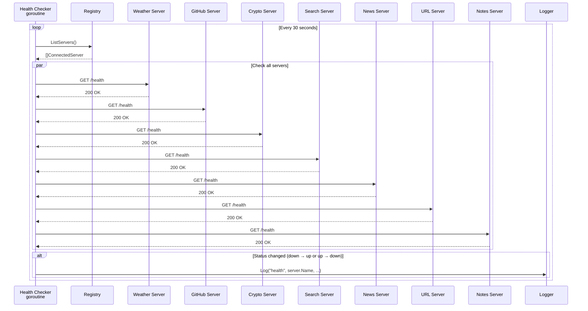

# sequence_healthcheck

```mermaid
sequenceDiagram
    participant HC as Health Checker<br/>goroutine
    participant REG as Registry
    participant S1 as Weather Server
    participant S2 as GitHub Server
    participant S3 as Crypto Server
    participant S4 as Search Server
    participant S5 as News Server
    participant S6 as URL Server
    participant S7 as Notes Server
    participant LOG as Logger

    loop Every 30 seconds
        HC->>REG: ListServers()
        REG-->>HC: []ConnectedServer

        par Check all servers
            HC->>S1: GET /health
            S1-->>HC: 200 OK

            HC->>S2: GET /health
            S2-->>HC: 200 OK

            HC->>S3: GET /health
            S3-->>HC: 200 OK

            HC->>S4: GET /health
            S4-->>HC: 200 OK

            HC->>S5: GET /health
            S5-->>HC: 200 OK

            HC->>S6: GET /health
            S6-->>HC: 200 OK

            HC->>S7: GET /health
            S7-->>HC: 200 OK
        end

        alt Status changed (down → up or up → down)
            HC->>LOG: Log("health", server.Name, ...)
        end
    end

```
